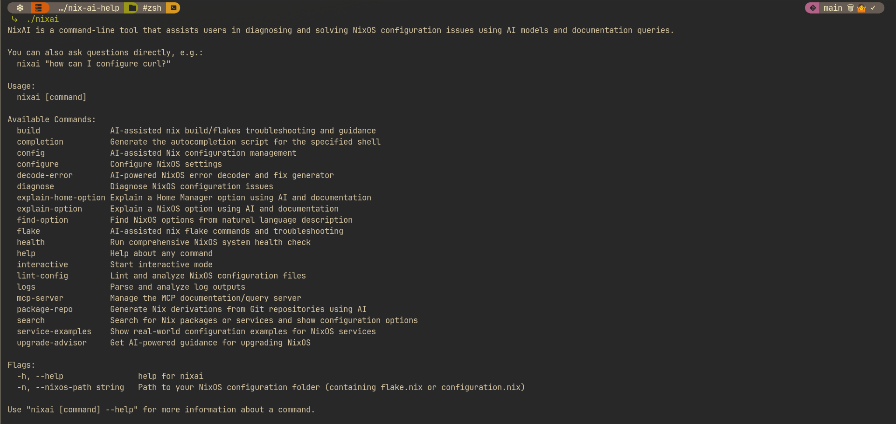
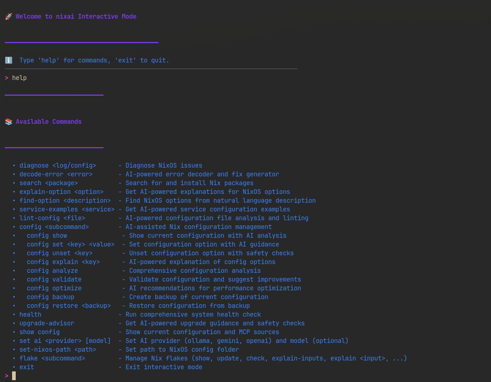
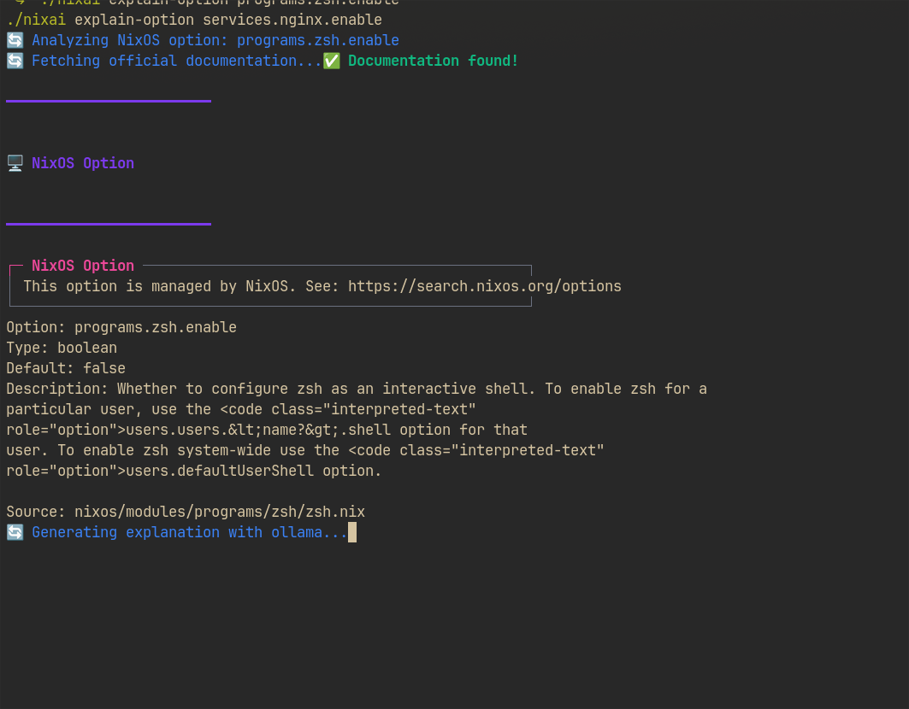
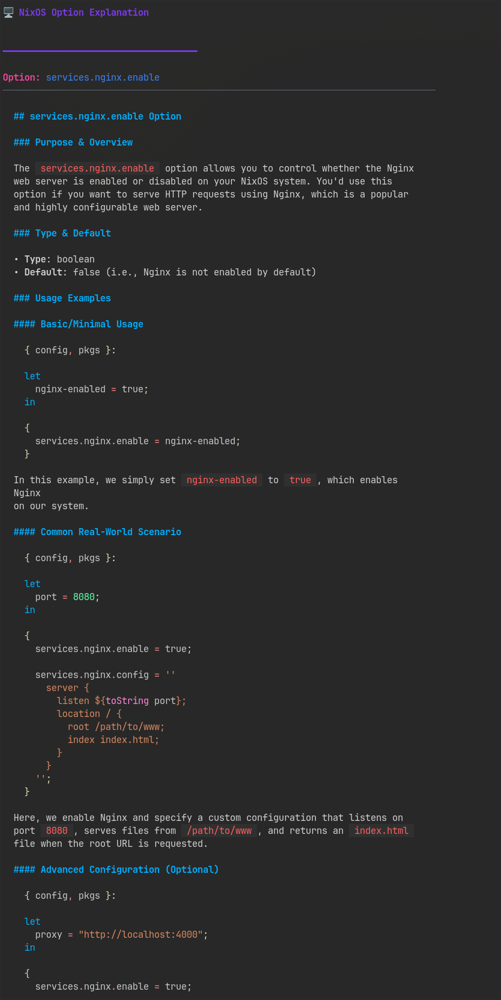
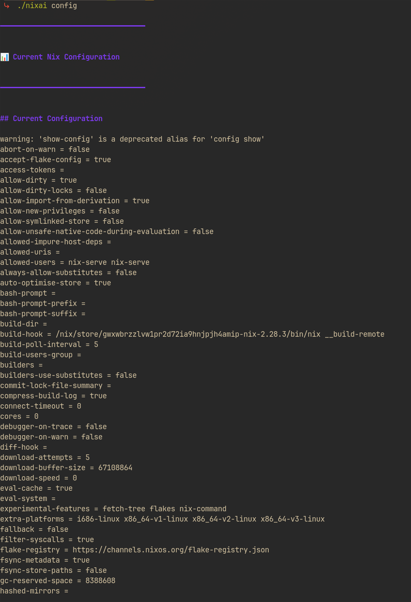
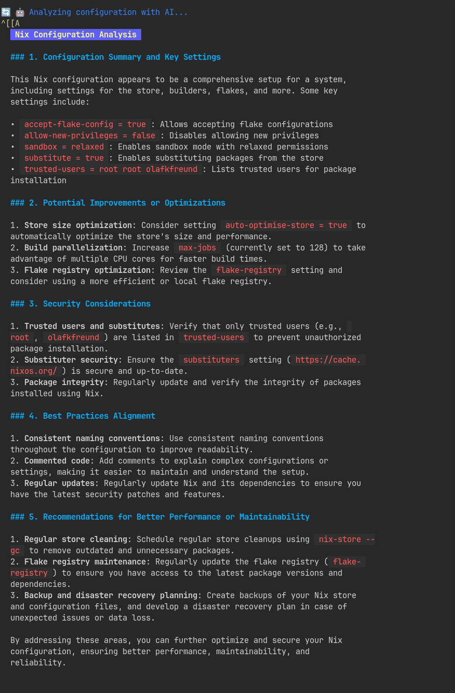

# nixai: NixOS AI Assistant


---

## 📖 User Manual

See the full [nixai User Manual](docs/MANUAL.md) for comprehensive feature documentation, advanced usage, real-world examples, and troubleshooting tips.

---

### This is development code. Things may not work or are broken. I'm changing the code all the time. Don't expect something production ready

## 🚀 What's New (May 2025)

- **🆕 Direct Question Assistant**: Ask questions instantly with `nixai "your question"` or `nixai --ask "question"` for immediate AI-powered NixOS help with documentation context.
- **Config Path Awareness Everywhere:** All features now respect the NixOS config path, settable via `--nixos-path`, config file, or interactively. If unset or invalid, you'll get clear guidance on how to fix it.
- **Automated Service Option Lookup:** When searching for services, nixai now lists all available options for a service using `nixos-option --find services.<name>`, not just the top-level enable flag.
- **Enhanced Error Handling:** If your config path is missing or invalid, nixai will print actionable instructions for setting it (CLI flag, config, or interactive command).
- **🏠 Home Manager vs NixOS Visual Distinction:** Smart detection automatically shows `🖥️ NixOS Option` or `🏠 Home Manager Option` headers with appropriate documentation sources.
- **🆕 Dedicated Home Manager Command:** New `explain-home-option` command specifically for Home Manager configuration options.
- **🆕 AI-Powered Package Repository Analysis:** New `package-repo` command automatically analyzes Git repositories and generates complete Nix derivations using AI-powered build system detection and dependency analysis.
- **More Tests:** New tests cover service option lookup, diagnostics, error handling, and packaging features for robust reliability.

## Prerequisites

Before using or developing nixai, ensure you have the following installed:

- **Ollama** (for local LLM inference)
  - You must have the `llama3` model pulled and available in Ollama:

```sh
ollama pull llama3
```

- **Nix** (with flakes enabled)
- **Go** (if developing outside Nix shell)
- **just** (for development tasks)
- **git**
- (Optional) API keys for OpenAI or Gemini if you want to use cloud LLMs

All other dependencies are managed by the Nix flake and justfile.


---

## 📚 Table of Contents

- [🚀 Project Overview](#-project-overview)
- [✨ Features](#-features)
- [🧩 Flake Input Analysis & AI Explanations](#-flake-input-analysis--ai-explanations)
- [🔧 NixOS Option Explainer](#-nixos-option-explainer)
- [📦 AI-Powered Package Repository Analysis](#-ai-powered-package-repository-analysis)
- [🔄 MCP Server Configuration & Autostart](#-mcp-server-configuration--autostart)
- [🎨 Terminal Output Formatting](#-terminal-output-formatting)
- [🛠️ Installation & Usage](#%EF%B8%8F-installation--usage)
- [📝 Commands & Usage](#-commands--usage)
- [🗺️ Project Plan](#%EF%B8%8F-project-plan)
- [Configuration](#configuration)
- [Build & Test](#build--test)
- [Where to Find NixOS Build Logs](#where-to-find-nixos-build-logs)
- [Example: Diagnosing a Build Failure](#example-diagnosing-a-build-failure)
- [🤝 Contributing](#-contributing)
- [📄 License](#-license)
- [🙏 Acknowledgments](#-acknowledgments)
- [📸 Screenshots](#-screenshots)

---

## 🚀 Project Overview

**nixai** is a powerful, console-based Linux application designed to help you solve NixOS configuration problems, create and configure NixOS systems, and diagnose issues—all from the command line. Simply ask questions like `nixai "how do I enable SSH?"` for instant AI-powered help. It leverages advanced Large Language Models (LLMs) like Gemini, OpenAI, and Ollama, with a strong preference for local Ollama models to ensure your privacy. nixai integrates an MCP server to query NixOS documentation from multiple official and community sources, and provides interactive and scriptable diagnostics, log parsing, and command execution.

---

## ✨ Features

- **🤖 Direct Question Assistant**: Ask questions directly with `nixai "your question"` or `nixai --ask "question"` for instant AI-powered NixOS help.

- Diagnose NixOS issues from logs, config snippets, or `nix log` output.

- Query NixOS documentation from multiple official and community sources.

- Search for Nix packages and services with clean, numbered results.

- Show configuration options for packages/services (integrates with `nixos-option`).

- **System Health Check**: Run comprehensive NixOS system health checks with AI-powered analysis.

- Specify your NixOS config folder with `--nixos-path`/`-n`.

- Execute and parse local NixOS commands.

- Accept log input via pipe or file.

- User-selectable AI provider (Ollama, Gemini, OpenAI, etc.).

- Interactive and CLI modes.

- Modular, testable, and well-documented Go codebase.

- Privacy-first: prefers local LLMs (Ollama) by default.

- **NEW:** 🧩 **Flake Input Analysis & AI Explanations** — Analyze and explain flake inputs using AI, with upstream README/flake.nix summaries.

- **NEW:** 🎨 **Beautiful Terminal Output** — All Markdown/HTML output is colorized and formatted for readability using [glamour](https://github.com/charmbracelet/glamour) and [termenv](https://github.com/muesli/termenv).

- **NEW:** ✅ **AI-Powered NixOS Option Explainer** — Get detailed, AI-generated explanations for any NixOS option with `nixai explain-option <option>`, including type, default, description, and best practices.

- **NEW:** 🏠 **Home Manager Option Support** — Dedicated `nixai explain-home-option <option>` command with visual distinction between Home Manager and NixOS options.

- **NEW:** 📦 **AI-Powered Package Repository Analysis** — Automatically analyze Git repositories and generate Nix derivations with `nixai package-repo <path>`, supporting Go, Python, Node.js, and Rust projects.

---

## 🔄 MCP Server Configuration & Autostart

The nixai Model Context Protocol (MCP) server provides NixOS documentation and option queries to enhance AI responses. You can configure how the server runs and automatically start it on boot:

### Socket Path Configuration

By default, the MCP server uses `/tmp/nixai-mcp.sock` as the Unix domain socket path. You can customize this path using:

- **Command-line flag**: `nixai mcp-server start --socket-path="/path/to/socket"`
- **Environment variable**: `NIXAI_SOCKET_PATH="/path/to/socket" nixai mcp-server start`
- **NixOS/Home Manager module**: Set the `socketPath` option in your configuration

### Autostart Options

The MCP server can be configured to start automatically on boot using either system-wide or user-level services:

#### NixOS Module (System-wide)

Add the nixai NixOS module to your configuration:

```nix
# configuration.nix
{ config, pkgs, ... }:

{
  imports = [ 
    # Path to the nixai flake or local module
    (builtins.fetchTarball "https://github.com/olafkfreund/nix-ai-help/archive/main.tar.gz")/modules/nixos.nix
  ];

  services.nixai = {
    enable = true;
    mcp = {
      enable = true;
      # Optional: custom socket path
      socketPath = "/run/nixai/mcp.sock";
    };
  };
}
```

#### Home Manager Module (User-level)

Add the nixai Home Manager module to your configuration:

```nix
# home.nix
{ config, pkgs, ... }:

{
  imports = [
    # Path to the nixai flake or local module
    (builtins.fetchTarball "https://github.com/olafkfreund/nix-ai-help/archive/main.tar.gz")/modules/home-manager.nix
  ];

  services.nixai = {
    enable = true;
    mcp = {
      enable = true;
      # Optional: custom socket path (uses $HOME expansion)
      socketPath = "$HOME/.local/share/nixai/mcp.sock";
    };
    # Optional: integrate with VS Code
    vscodeIntegration = true;
  };
}
```

#### Using Flakes

If you're using flakes, you can import the modules directly:

```nix
{
  inputs = {
    nixpkgs.url = "github:NixOS/nixpkgs/nixos-unstable";
    home-manager.url = "github:nix-community/home-manager";
    nixai.url = "github:olafkfreund/nix-ai-help";
  };

  outputs = { self, nixpkgs, home-manager, nixai, ... }: {
    nixosConfigurations.yourhostname = nixpkgs.lib.nixosSystem {
      # ...
      modules = [
        nixai.nixosModules.default
        {
          services.nixai = {
            enable = true;
            mcp.enable = true;
          };
        }
      ];
    };
    
    homeConfigurations.yourusername = home-manager.lib.homeManagerConfiguration {
      # ...
      modules = [
        nixai.homeManagerModules.default
        {
          services.nixai = {
            enable = true;
            mcp.enable = true;
          };
        }
      ];
    };
  };
}
```

See [Autostart Options Documentation](docs/autostart-options.md) for more detailed examples and troubleshooting.

---

## ✨ Latest Features & Updates

### Recent Fixes & Improvements (May 2025)

- **✅ HTML Filtering for Clean Documentation:** The `explain-home-option` and `explain-option` commands now properly filter out HTML tags, wiki navigation elements, DOCTYPE declarations, and raw content, providing clean, formatted output with beautiful markdown rendering via glamour.
- **🎨 Enhanced Terminal Output Formatting:** All documentation output uses consistent formatting with headers, dividers, key-value pairs, and glamour markdown rendering for improved readability across all terminal environments.
- **🔧 Robust Error Handling:** Better error messages, graceful handling when MCP server is unavailable, improved timeout handling, and clear feedback for configuration issues.
- **🏠 Home Manager Option Support:** Dedicated `explain-home-option` command with smart visual distinction between Home Manager and NixOS options, including proper source detection and documentation filtering.
- **🔌 Full Editor Integration:** Complete support for Neovim and VS Code with MCP server integration for seamless in-editor NixOS assistance, including automatic setup commands and configuration generators.
- **🧪 Comprehensive Testing:** All HTML filtering, documentation display, and error handling improvements are backed by extensive test coverage to ensure reliability.

### Core Features

- **🤖 Direct Question Assistant:** Ask questions directly with `nixai "your question"` or `nixai --ask "question"` for instant AI-powered NixOS help with documentation context.
- **🎯 Config Path Awareness Everywhere:** All features respect the NixOS config path, settable via `--nixos-path`, config file, or interactively. If unset or invalid, you'll get clear guidance on how to fix it.
- **🔍 Automated Service Option Lookup:** When searching for services, nixai lists all available options for a service using `nixos-option --find services.<name>`, not just the top-level enable flag.
- **📦 AI-Powered Package Repository Analysis:** Analyze Git repositories and generate complete Nix derivations with support for Go, Python, Node.js, and Rust projects.
- **🧩 Flake Input Analysis:** Analyze and explain flake inputs using AI, with upstream README/flake.nix summaries.
- **🏥 System Health Checks:** Run comprehensive NixOS system health checks with AI-powered analysis and recommendations.
- **✅ Comprehensive Test Coverage:** Extensive test coverage for service option lookup, diagnostics, error handling, packaging features, and HTML filtering for robust reliability.

---

## 🧩 Flake Input Analysis & AI Explanations

Easily analyze your `flake.nix` inputs and get AI-powered explanations for each input, including upstream README and flake.nix summaries. nixai supports both `name.url = ...;` and `name = { url = ...; ... };` forms, robustly handling comments and whitespace.

**Example:**

```sh
nixai flake explain --flake /path/to/flake.nix
```

---

## 🔧 NixOS Option Explainer

Get comprehensive, AI-powered explanations for any NixOS option with **usage examples**, **best practices**, and **related options**:

```sh
# Get detailed explanation with examples and best practices
nixai explain-option services.nginx.enable

# Comprehensive firewall configuration guide
nixai explain-option networking.firewall.enable

# Boot loader setup with real-world examples
nixai explain-option boot.loader.systemd-boot.enable

# Natural language queries also work
nixai explain-option "how to enable SSH access"

# Get help for complex nested options with advanced examples
nixai explain-option services.postgresql.settings.shared_preload_libraries
```

**What you get with each explanation:**

- 📖 **Purpose & Overview**: Clear explanation of what the option does
- 🔧 **Type & Default**: Data type and default value information
- 💡 **Usage Examples**: Basic, real-world, and advanced configuration examples
- ⭐ **Best Practices**: Tips, warnings, and recommendations
- 🔗 **Related Options**: Other options that work well together
- 🎨 **Beautiful Formatting**: Colorized terminal output with proper syntax highlighting

**Available in both CLI and interactive modes:**

```sh
# CLI mode - NixOS options
nixai explain-option services.nginx.enable
nixai explain-option networking.firewall.enable

# CLI mode - Home Manager options  
nixai explain-home-option programs.git.enable
nixai explain-home-option home.username

# Interactive mode
nixai interactive
> explain-option <option>
> explain-home-option <option>
```

**🎯 Smart Visual Distinction**: nixai automatically detects and displays the appropriate headers:

- `🖥️ NixOS Option` for system-level configuration options
- `🏠 Home Manager Option` for user-level configuration options

The Option Explainer provides:

- **Type**: The data type of the option (boolean, string, list, etc.)
- **Default Value**: What the option defaults to if not set
- **Description**: Official documentation from NixOS/Home Manager
- **Source**: The module file where the option is defined
- **AI Explanation**: Context, purpose, and best practices
- **Usage Examples**: Practical configuration examples (basic, common, advanced)
- **Related Options**: Other options that work well together

---

## 📦 AI-Powered Package Repository Analysis

Automatically analyze Git repositories and generate complete Nix derivations using AI-powered build system detection and dependency analysis. nixai supports multiple programming languages and automatically generates proper Nix packaging files.

**Example:**

```sh
# Analyze current directory and generate derivation
nixai package-repo . --local

# Analyze specific project
nixai package-repo /path/to/project

# Analyze only (no derivation generation)
nixai package-repo . --analyze-only

# Remote repository analysis
nixai package-repo https://github.com/user/project
```

**Supported Languages & Build Systems:**

- **Go**: Detects go.mod, analyzes dependencies, generates buildGoModule derivations
- **Python**: Detects setup.py/pyproject.toml, analyzes pip dependencies
- **Node.js**: Detects package.json, analyzes npm dependencies, generates buildNpmPackage derivations
- **Rust**: Detects Cargo.toml, analyzes crate dependencies, generates buildRustPackage derivations

**What you get with each analysis:**

- 🔍 **Build System Detection**: Automatically identifies project type and build files
- 📊 **Dependency Analysis**: Extracts and analyzes all project dependencies
- 🤖 **AI-Generated Derivations**: Complete, valid Nix derivations with proper structure
- ✅ **Validation**: Ensures generated derivations include all required attributes
- 📝 **Metadata Extraction**: Project name, version, license, and description detection
- 🔗 **Git Integration**: Automatic source URL and commit information extraction

**Key Features:**

- **Multi-Language Support**: Works with Go, Python, Node.js, and Rust projects
- **Build System Detection**: Automatically identifies build files and project structure
- **AI-Powered Generation**: Uses advanced AI to generate complete, working derivations
- **Comprehensive Validation**: Validates generated derivations for completeness and correctness
- **Path Resolution**: Supports both relative and absolute paths
- **Debug Mode**: Comprehensive logging for troubleshooting and development

---

## 🎨 Terminal Output Formatting

All Markdown and HTML output from nixai is rendered as beautiful, colorized terminal output using [glamour](https://github.com/charmbracelet/glamour) and [termenv](https://github.com/muesli/termenv). This makes AI explanations, documentation, and search results easy to read and visually appealing.

- Works in all modern terminals.
- Respects your terminal theme (light/dark).
- Makes complex output (tables, code, links) readable at a glance.

---

## 🔌 Editor Integration

nixai provides seamless integration with popular editors through the MCP (Model Context Protocol) server, enabling you to access NixOS documentation and AI assistance directly within your development environment.

### 🔷 VS Code Integration

Complete VS Code integration with Copilot, Claude Dev, and other MCP-compatible extensions:

**Quick Setup:**
```sh
# Start the MCP server
nixai mcp-server start -d

# Check server status
nixai mcp-server status
```

**Required Extensions:**
- `automatalabs.copilot-mcp` - Copilot MCP extension
- `zebradev.mcp-server-runner` - MCP Server Runner
- `saoudrizwan.claude-dev` - Claude Dev (Cline)

**Configuration (.vscode/settings.json):**
```json
{
  "mcp.servers": {
    "nixai": {
      "command": "bash",
      "args": ["-c", "socat STDIO UNIX-CONNECT:/tmp/nixai-mcp.sock"],
      "env": {}
    }
  },
  "copilot.mcp.servers": {
    "nixai": {
      "command": "bash", 
      "args": ["-c", "socat STDIO UNIX-CONNECT:/tmp/nixai-mcp.sock"],
      "env": {}
    }
  },
  "claude-dev.mcpServers": {
    "nixai": {
      "command": "bash",
      "args": ["-c", "socat STDIO UNIX-CONNECT:/tmp/nixai-mcp.sock"],
      "env": {}
    }
  },
  "mcp.enableDebug": true,
  "claude-dev.enableMcp": true
}
```

### 🟢 Neovim Integration

Comprehensive Neovim integration with lua configuration and keybindings:

**Automatic Setup:**
```sh
# Automatically configure Neovim integration
nixai neovim-setup

# With custom socket path
nixai neovim-setup --socket-path=$HOME/.local/share/nixai/mcp.sock

# With custom config directory
nixai neovim-setup --config-dir=$HOME/.config/nvim
```

**Manual Setup (init.lua):**
```lua
-- nixai integration
local ok, nixai = pcall(require, "nixai")
if ok then
  nixai.setup({
    socket_path = "/tmp/nixai-mcp.sock",
    keybindings = true, -- Enable default keybindings
  })
else
  vim.notify("nixai module not found", vim.log.levels.WARN)
end
```

**Available Commands:**
- `:NixaiExplainOption <option>` - Explain NixOS options
- `:NixaiExplainHomeOption <option>` - Explain Home Manager options
- `:NixaiSearch <query>` - Search packages and services
- `:NixaiDiagnose` - Diagnose current buffer or selection
- `:NixaiAsk <question>` - Ask direct questions

**Default Keybindings:**
- `<leader>ne` - Explain option under cursor
- `<leader>ns` - Search packages/services
- `<leader>nd` - Diagnose current buffer
- `<leader>na` - Ask nixai a question

### 🏠 Home Manager Integration

Both editors can be automatically configured through Home Manager:

```nix
# home.nix
{ config, pkgs, ... }:
{
  imports = [
    # Import the nixai Home Manager module
    (builtins.fetchTarball "https://github.com/olafkfreund/nix-ai-help/archive/main.tar.gz")/modules/home-manager.nix
  ];

  services.nixai = {
    enable = true;
    mcp = {
      enable = true;
      socketPath = "$HOME/.local/share/nixai/mcp.sock";
    };
    # Automatically configure VS Code
    vscodeIntegration = true;
    # Automatically configure Neovim  
    neovimIntegration = true;
  };
}
```

For detailed setup instructions and troubleshooting, see:
- [VS Code Integration Guide](docs/MCP_VSCODE_INTEGRATION.md)
- [Neovim Integration Guide](docs/neovim-integration.md)

---

## 🛠️ Installation & Usage

### Using Nix (Recommended)

**For Development Environment:**

```sh
# Enter development environment (includes Go, just, golangci-lint, etc.)
nix develop

# Build using just (recommended)
just build
./nixai --help
```

### System Integration with NixOS and Home Manager

nixai can be integrated into your NixOS or Home Manager configuration using the provided modules:

```nix
# NixOS configuration
{ config, pkgs, ... }:
{
  imports = [
    # Path to module (can be from flake or local)
    ./path/to/nixai/modules/nixos.nix 
  ];
  
  services.nixai = {
    enable = true;
    mcp = {
      enable = true;
      # Optional configuration
    };
  };
}
```

```nix
# Home Manager configuration
{ config, pkgs, ... }:
{
  imports = [
    # Path to module (can be from flake or local)
    ./path/to/nixai/modules/home-manager.nix
  ];
  
  services.nixai = {
    enable = true;
    mcp = {
      enable = true;
      # Optional configuration
    };
  };
}
```

See the [MCP Server Configuration & Autostart](#-mcp-server-configuration--autostart) section for more details.

**For Direct Nix Build:**

```sh
# Note: Nix direct build currently has some packaging issues
# Use the development environment + just build instead
nix build .#nixai  # Currently under development
```

### Using Go

```sh
go build -o nixai ./cmd/nixai/main.go

./nixai
```

### Common Tasks (with just)

```sh
just build   # Build the application

just run     # Run the application

just test    # Run tests

just lint    # Lint the code

just fmt     # Format the code

just all     # Clean, build, test, and run
```

---

## 🧑‍💻 Development Setup (For New Contributors)

This project uses **Nix flakes** for reproducible development environments. Here's the complete workflow for new users:

### Prerequisites

- **Nix** with flakes enabled
- **Git** for version control

### Quick Start

1. **Clone the repository:**

   ```sh
   git clone <repository-url>
   cd nix-ai-help
   ```

2. **Enter the development environment:**

   ```sh
   nix develop
   ```

   This automatically provides:
   - Go 1.24.3
   - just (task runner)
   - golangci-lint
   - All required development tools

3. **Clean and install dependencies:**

   ```sh
   go clean -modcache  # Clean any cached modules
   go mod tidy         # Download and organize dependencies
   ```

4. **Build the project:**

   ```sh
   just build
   ```

5. **Test the application:**

   ```sh
   ./nixai --help      # Verify the build works
   just test           # Run the test suite
   ```

### Development Commands

```sh
# Available just commands (run `just -l` to see all)
just build          # Build nixai binary
just test           # Run all tests
just lint           # Run linter (may show minor issues)
just fmt            # Format Go code
just clean          # Remove build artifacts
just run            # Build and run nixai
just deps           # Install/update dependencies

# Manual Go commands
go build -o nixai ./cmd/nixai/main.go    # Direct Go build
go test ./...                            # Direct test execution
go mod tidy                              # Update dependencies
```

### Project Structure

```
├── cmd/nixai/           # Main application entry point
├── internal/            # Internal packages
│   ├── ai/             # LLM provider integrations (Ollama, OpenAI, Gemini)
│   ├── cli/            # CLI commands and interactive mode
│   ├── config/         # Configuration management (YAML)
│   ├── mcp/            # MCP server for documentation queries
│   └── nixos/          # NixOS-specific diagnostics and parsing
├── pkg/                # Public utility packages
│   ├── logger/         # Structured logging
│   └── utils/          # General utilities
├── configs/            # Default configuration files
├── flake.nix          # Nix flake for development environment
└── justfile           # Task automation
```

### Testing Your Changes

1. **Unit tests:**

   ```sh
   just test
   ```

2. **Integration testing:**

   ```sh
   # Test specific functionality
   ./nixai --help
   ./nixai search nginx
   ./nixai explain-option services.nginx.enable
   ```

3. **Code quality:**

   ```sh
   just lint  # Check for code quality issues
   just fmt   # Format code automatically
   ```

### Common Development Issues

- **Module permission errors**: Run `go clean -modcache` and `go mod tidy`
- **Build failures**: Ensure you're in the Nix development shell (`nix develop`)
- **Missing tools**: The Nix flake provides all required tools automatically

---

## 📝 Commands & Usage

### Ask Questions Directly

The quickest way to get help with NixOS configuration is to ask questions directly:

```sh
# Ask questions directly (most common usage)
nixai "how do I enable SSH in NixOS?"
nixai "what is a Nix flake?"
nixai "how do I configure nginx with SSL?"

# Alternative: use the --ask flag
nixai --ask "how do I update packages in NixOS?"
nixai -a "what's the difference between NixOS and other Linux distributions?"

# Both methods work identically and provide:
# - AI-powered answers with examples
# - Context from official NixOS documentation  
# - Best practices and recommendations
# - Beautiful formatted terminal output
```

**Features:**
- 🤖 **AI-Powered Responses**: Get comprehensive answers using Ollama, Gemini, or OpenAI
- 📚 **Documentation Context**: Automatic querying of official NixOS docs via MCP server
- 🎨 **Beautiful Output**: Colorized markdown with syntax highlighting
- ⚡ **Fast & Simple**: Just ask your question naturally

### Diagnose NixOS Issues

```sh
nixai diagnose --log-file /path/to/logfile

nixai diagnose --nix-log [drv-or-path]   # Analyze the output of `nix log` (optionally with a derivation/path)

nixai diagnose --config-snippet '...'

echo "...log..." | nixai diagnose
```

### Search for Packages or Services

```sh
nixai search pkg <query>

nixai search service <query>
```

- Clean, numbered results.

- Select a result to see config/test options and available `nixos-option` settings.

### Explain NixOS Options

```sh
nixai explain-option <option>
```

- Get AI-powered explanations for any NixOS option.
- Includes type, default value, description, and best practices.
- Uses official NixOS documentation from Elasticsearch backend.
- Automatically detects and displays `🖥️ NixOS Option` headers for system-level options.

### Explain Home Manager Options

```sh
nixai explain-home-option <option>
```

- Get AI-powered explanations for Home Manager options.
- Dedicated command for user-level configuration options.
- Shows `🏠 Home Manager Option` headers with appropriate documentation sources.
- Perfect for understanding programs, services, and home directory management.

### AI-Powered Package Repository Analysis

```sh
nixai package-repo <path>
```

- Automatically analyze Git repositories and generate Nix derivations.
- Supports Go, Python, Node.js, and Rust projects with intelligent build system detection.
- AI-powered derivation generation with nixpkgs best practices.
- Comprehensive dependency analysis and nixpkgs mapping.

**Examples:**

```sh
# Analyze current directory and generate derivation
nixai package-repo . --local

# Analyze specific project
nixai package-repo /path/to/project

# Analyze only (no derivation generation)
nixai package-repo . --analyze-only

# Remote repository analysis
nixai package-repo https://github.com/user/project

# Custom output directory and package name
nixai package-repo https://github.com/user/rust-app --output ./derivations --name my-package
```

**Key Features:**

- **Multi-Language Support**: Detects Go modules, npm packages, Python projects, Rust crates
- **Build System Detection**: Automatically identifies build files and project structure
- **AI Generation**: Creates complete, valid derivations with proper structure and metadata
- **Validation**: Ensures generated derivations include all required attributes
- **Git Integration**: Automatic source URL and commit information extraction

### System Health Check

```sh
nixai health
```

- Run comprehensive NixOS system health checks.
- Validates configuration, checks service status, disk space, and more.
- Provides AI-powered analysis and actionable recommendations.
- Beautiful, colorized terminal output with progress indicators.

### Interactive Mode

```sh
nixai interactive
```

- Supports all search, diagnose, and health check features.

- Use `set-nixos-path` to specify your config folder interactively.

### MCP Server Management

```sh
# Start the MCP server (foreground)
nixai mcp-server start

# Start in background (daemon mode)
nixai mcp-server start --background
nixai mcp-server start --daemon  # alias for --background

# With custom socket path
nixai mcp-server start --socket-path="/path/to/socket"

# Check MCP server status
nixai mcp-server status

# Stop the MCP server
nixai mcp-server stop
```

- MCP server provides NixOS documentation and options data to enhance AI responses
- Can be configured to use a custom socket path for communication
- Supports running as a background daemon process
- Use environment variable `NIXAI_SOCKET_PATH` to set socket path system-wide

### Editor Integration

#### Neovim Integration

```sh
# Set up Neovim integration
nixai neovim-setup

# With custom socket path
nixai neovim-setup --socket-path="/path/to/mcp.sock"

# With custom Neovim config directory
nixai neovim-setup --config-dir="/path/to/neovim/config"
```

Once set up, use these keybindings in Neovim:

- `<leader>nq` - Ask a NixOS question
- `<leader>ns` - Get context-aware suggestions
- `<leader>no` - Explain a NixOS option
- `<leader>nh` - Explain a Home Manager option

See [Neovim Integration](docs/neovim-integration.md) for detailed setup instructions and advanced usage.

---

## 📝 How to Use the Latest Features

### Set or Fix Your NixOS Config Path

- **CLI:**

  ```sh
  nixai search --nixos-path /etc/nixos pkg <query>
  ```

- **Config File:**

  Edit `~/.config/nixai/config.yaml` and set `nixos_folder: /etc/nixos`.

- **Interactive:**

  Start with `nixai interactive` and use `set-nixos-path`.

If the path is missing or invalid, nixai will show you exactly how to fix it.

### Automated Service Option Lookup

- When you search for a service (e.g., `nixai search service nginx`), nixai will now display all available options for that service, not just the enable flag. This uses `nixos-option --find` for comprehensive results.

### Error Guidance

- If you run a command and the config path is not set or is invalid, nixai will print a clear error and suggest how to set it.

### Testing

- All new features are covered by tests. Run them with:

  ```sh
  just test
  # or
  go test ./...
  ```

---

## 🗺️ Project Plan

### 1. **Core Architecture**

- Modular Go codebase with clear package boundaries.

- YAML-based configuration (`configs/default.yaml`) for all settings.

- Main entrypoint: `cmd/nixai/main.go`.

### 2. **AI Integration**

- Support for multiple LLM providers: Ollama (local), Gemini, OpenAI, and more.

- User-selectable provider with Ollama as default for privacy.

- All LLM logic in `internal/ai`.

### 3. **Documentation Query (MCP Server)**

- MCP server/client in `internal/mcp`.

- Query NixOS docs from:

  - [NixOS Wiki](https://wiki.nixos.org/wiki/NixOS_Wiki)

  - [nix.dev manual](https://nix.dev/manual/nix)

  - [Nixpkgs Manual](https://nixos.org/manual/nixpkgs/stable/)

  - [Nix Language Manual](https://nix.dev/manual/nix/2.28/language/)

  - [Home Manager Manual](https://nix-community.github.io/home-manager/)

- Always use sources from config.

### 4. **Diagnostics & Log Parsing**

- Log parsing and diagnostics in `internal/nixos`.

- Accept logs via pipe, file, or CLI.

- Execute and parse local NixOS commands.

### 5. **CLI & Interactive Mode**

- All CLI logic in `internal/cli`.

- Interactive and scriptable modes.

- User-friendly command structure.

### 6. **Utilities & Logging**

- Logging via `pkg/logger`, respecting config log level.

- Utility helpers in `pkg/utils`.

### 7. **Testing & Build**

- Use `justfile` for build, test, lint, and run tasks.

- Nix (`flake.nix`) for reproducible builds and dev environments.

- All new features must be testable and documented.

### 8. **Documentation & Contribution**

- Update this `README.md` and code comments for all changes.

- Keep `.github/copilot-instructions.md` up to date.

- Contributions welcome via PR or issue.

---

## Configuration

nixai supports persistent, user-editable configuration for all users. On first run, a config file is created at:

You can edit this file to set your preferred NixOS config folder, AI provider, model, log level, documentation sources, and more. Example contents:

```yaml
ai_provider: ollama
ai_model: llama3
nixos_folder: ~/nixos-config
log_level: info
mcp_server:
  host: localhost
  port: 8080
  socket_path: /tmp/nixai-mcp.sock  # Custom Unix socket path
  documentation_sources:
    - https://wiki.nixos.org/wiki/NixOS_Wiki
    - https://nix.dev/manual/nix
    - https://nixos.org/manual/nixpkgs/stable/
    - https://nix.dev/manual/nix/2.28/language/
    - https://nix-community.github.io/home-manager/
nixos:
  config_path: ~/nixos-config/configuration.nix
  log_path: /var/log/nixos/nixos-rebuild.log
diagnostics:
  enabled: true
  threshold: 1
commands:
  timeout: 30
  retries: 2
```

---

## Build & Test

### Using Nix (Recommended for Reproducible Builds)

The project includes a comprehensive Nix flake for reproducible development:

```sh
# Enter development environment (includes Go, just, golangci-lint, etc.)
nix develop

# Build the project
just build

# Run all tests
just test-all

# Check code quality
just lint

# Build using Nix directly
nix build .#nixai
```

### Test Structure

Tests are organized in the `tests/` directory by category:

- **MCP Tests**: `tests/mcp/` - Tests for MCP protocol and server
- **VS Code Tests**: `tests/vscode/` - Tests for VS Code integration
- **Provider Tests**: `tests/providers/` - Tests for AI provider integration

Run specific test groups:

```sh
# MCP tests only
just test-mcp

# VS Code integration tests only
just test-vscode

# AI provider tests only
just test-providers
```

Check test environment compatibility:

```sh
./tests/check-compatibility.sh
```

### Using Go Directly

```sh
# Clean module cache if needed
go clean -modcache

# Download dependencies
go mod tidy

# Build
go build -o nixai ./cmd/nixai/main.go

# Test
go test ./...

# Run
./nixai --help
```

### Development Workflow

1. **Setup**: `nix develop` (or ensure Go 1.24+ is installed)
2. **Dependencies**: `go mod tidy`
3. **Build**: `just build`
4. **Test**: `just test`
5. **Quality Check**: `just lint`
6. **Run**: `./nixai --help`

### Available Just Commands

Run `just -l` to see all available commands:

- `just build` - Build the nixai binary
- `just test` - Run all tests
- `just lint` - Run linter (static analysis)
- `just fmt` - Format Go code
- `just clean` - Remove build artifacts
- `just run` - Build and run nixai
- `just deps` - Install/update dependencies
- `just all` - Clean, build, test, and run

Use the `justfile` for common tasks: `just build`, `just test`, etc.

Nix (`flake.nix`) provides a reproducible dev environment.

---

## Where to Find NixOS Build Logs

- Latest build logs: `/var/log/nixos/nixos-rebuild.log` (system), `/var/log/nix/drvs/` (per-derivation).

- Use `nix log` for recent build failures.

---

## Example: Diagnosing a Build Failure

```sh
sudo nixos-rebuild switch

nixai diagnose --nix-log
```

---

## 🤝 Contributing

- All code must be idiomatic Go, modular, and well-documented.

- Add or update tests for all new features and bugfixes.

- See PROJECT_PLAN.md for roadmap and tasks.

---

## 📄 License

This project is licensed under the MIT License. See the LICENSE file for details.

---

## 🙏 Acknowledgments

- Thanks to the NixOS community and documentation authors.

- Special thanks to the creators of the AI models used in this project.

---

## 📸 Screenshots

Below are example screenshots of `nixai` in action:

| Example | Screenshot |
|---------|------------|
| Option Explanation |  |
| Package Analysis   |  |
| Derivation Output  |  |
| Health Check       |  |
| Service Example    |  |
| Interactive Mode   |  |
| Error Decoder      |  |

---

> _nixai: Your AI-powered NixOS assistant, right in your terminal._
